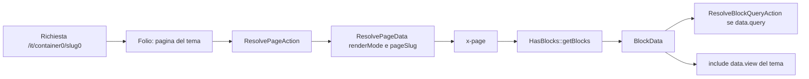

# Cms: pagine a blocchi in JSON, risolte da Folio senza rotte scritte a mano

<!-- laraxot:badges:start -->
<!-- laraxot:badges:end -->

> **Una `Page` è un file JSON con tre liste di blocchi. Folio la trova per slug, `HasBlocks` la compila, `BlockData` la rende con la vista del tema.**

## In trenta secondi

Cms fornisce i modelli `Page`, `PageContent`, `Section`, `Menu`, `Attachment`, `Module` e `Conf`. I primi cinque non leggono tabelle MySQL: con il trait `SushiToJsons` del modulo Tenant ogni record è un file `database/content/<tabella>/<id>.json` nella cartella del tenant, caricato in memoria da Sushi. `FolioVoltServiceProvider` monta le pagine Folio del tema pubblico e dei moduli per ogni locale supportato; `ResolvePageAction` decide se una URL `/{container0}/{slug0}` corrisponde a un modello dinamico o a una pagina Cms; il componente `<x-page>` rende i blocchi. Header, footer e breadcrumb si configurano dal cluster Filament `Appearance`, il tema pubblico si cambia dalla pagina `Themes`.

## Perché esiste

Un sito ha bisogno di pagine che il cliente modifica senza uno sviluppatore, e di un tema che il designer cambia senza toccare i contenuti. Cms tiene separate le tre cose: la struttura dei blocchi è dichiarata in classi `XotBaseBlock` (`app/Filament/Blocks`), il contenuto vive in JSON traducibile per locale, la presentazione è una vista `pub_theme::components.blocks.*` scelta blocco per blocco nel campo `data.view`. Le rotte pubbliche non esistono in `routes/web.php`: le scopre Folio dai file del tema, e `routes/web.php` contiene solo il redirect da `/` a `/<locale>`.

## Come funziona

1. `CmsServiceProvider` (`XotBaseServiceProvider`) registra il namespace Blade `pub_theme::` su `Themes/<xra.pub_theme>/resources/views`, carica i lang del tema e imposta `view.paths`, `livewire.view_path` e `livewire.class_namespace` sul tema.
2. `FolioVoltServiceProvider` legge `laravellocalization.supportedLocales` e per ogni locale chiama `Folio::path(<tema>/resources/views/pages)->uri($locale)` con middleware `SetFolioLocale`, `LaravelLocalizationRoutes`, `LocaleSessionRedirect` e `LaravelLocalizationRedirectFilter`. Fa lo stesso per `Modules/*/resources/views/pages` (la sottocartella `pages/api` va su `/api`), poi `Volt::mount()` su pages, livewire e `components/blocks` del tema.
3. La pagina Folio del tema `[container0]/[slug0]/index.blade.php` chiama `ResolvePageAction::execute($container0, $slug0)` e riceve un `ResolvePageData` con `renderMode` (`model` oppure `cms`) e `pageSlug` (`container0.slug0`, fallback `container0.view`). I modelli dinamici si cercano in `xra.container0_model_map` e per convenzione in `Modules\<Container>\Models\<Singolare>`.
4. `PageSlugMiddleware` legge `Page::getMiddlewareBySlug($slug)` e applica i middleware salvati nel campo `middleware` del JSON della pagina.
5. `<x-page side="content" :slug="$pageSlug">` istanzia `Modules\Cms\View\Components\Page`, che chiama `Page::getBlocksBySlug($slug, $side)`; `HasBlocks::getBlocks()` sceglie la traduzione (`XotData::primary_lang`), compila con `Blade::render()` le stringhe `{{ }}` contenute nel JSON e crea un `BlockData` per blocco.
6. `BlockData` verifica che `data.view` esista e, se c'è `data.query`, chiama `ResolveBlockQueryAction` per caricare i record (`model`, `scope`/`scopes`, `orderBy`, `direction`, `limit`, `wrap_in`). La vista `cms::components.page` fa `@include($block->view, ...)` e salta i blocchi con `active = false`.



## Il modello dati

| Modello | Tabella e JSON | Campi chiave | Classe base |
|---|---|---|---|
| `Page` | `pages`, `database/content/pages/*.json` | `slug` unico, `title`, `middleware`, `content_blocks`, `sidebar_blocks`, `footer_blocks` (traducibili) | `BaseModelLang` + `HasBlocks`, `SushiToJsons` |
| `PageContent` | `page_contents` | `name`, `slug`, `blocks` (traducibili) | `BaseModel` + `HasTranslations`, `SushiToJsons` |
| `Section` | `sections` | `name`, `slug`, `blocks` | `BaseModelLang` + `HasBlocks`, `SushiToJsons` |
| `Menu` | `menus` | `title`, `items`, `parent_id`; albero con `HasRecursiveRelationships` | `BaseModel`, `HasRecursiveRelationshipsContract` |
| `Attachment` | `attachments` | `title`, `description`, `slug`, `disk` (`AttachmentDiskEnum`: `public_html`, `videos`, `local`), `attachment`; media collection `attachments` | `BaseModelLang`, `HasMedia` |
| `Module` | virtuale (Sushi) | righe da `Module::getByStatus(1)` di nwidart | `BaseModel` |
| `Conf` | virtuale (Sushi) | righe da `GetTenantConfigNamesAction` | `BaseModel` |

`BaseModel extends XotBaseModel` con `$connection = 'cms'`; `BaseModelLang` aggiunge `HasTranslations`; `BaseTreeModel`, `BasePivot extends XotBasePivot` e `BaseMorphPivot extends XotBaseMorphPivot` completano la base. Le tre migrazioni `XotBaseMigration` in `database/migrations` creano `page_contents`, `menus` (rinomina `name` in `title`, aggiunge `parent_id`) e `pages` (aggiunge `content_blocks`, `sidebar_blocks`, `footer_blocks`). Non esistono relazioni Eloquent tra `Page` e `Section`: il collegamento è per `slug`.

## Superpoteri

Actions Spatie `QueueableAction` in `app/Actions`:

| Action | Firma di `execute()` | Cosa fa |
|---|---|---|
| `ResolvePageAction` | `(string $container0, string $slug0): ResolvePageData` | modello dinamico oppure pagina Cms per slug |
| `ResolveBlockQueryAction` | `(array $queryConfig): array` | esegue la query dichiarata in `data.query`, usa `toBlockArray()` se il modello lo espone |
| `ResolveLocalizedBlockDataAction` | `(array $data): array` | riscrive le chiavi `url`, `link`, `href`, `action_url`, `path` con `LaravelLocalization::getLocalizedURL` |
| `BuildPageSchemaAction` | `(MetatagData $meta, ?string $routeName, string $path, array $routeParameters = [], ?Authenticatable $user = null): array` | JSON-LD schema.org: `WebPage`, `AboutPage`, `ContactPage`, `ProfilePage`, `CollectionPage`, `ItemPage` |
| `SaveHeadernavConfigAction` | `(HeadernavData $data): void` | scrive `appearance.headernav` con `SaveTenantConfigAction` |
| `SaveFooterConfigAction` | `(FooterData $data): void` | scrive `appearance.footer` |
| `GetViewThemeByViewAction` | `(string $view = ''): string` | sostituisce il namespace con `pub_theme::` o `adm_theme::` se la vista esiste |
| `GetStyleClassAction` | `(string $tpl = ''): string` | legge la classe CSS `<tema>::<componente>.class` da config |
| `View\GetCmsViewAction` | `(string $viewName): string` | valida che la vista esista |
| `Module\FixJigSawByModuleAction` | `(Module $module): array` | pubblica gli stub `docs` di `app/Console/Commands/stubs` in un modulo |

Backoffice Filament (`app/Filament`):

- `PageResource`, `PageContentResource`, `SectionResource`, `AttachmentResource` estendono `LangBaseResource` del modulo Lang; `MenuResource` estende `XotBaseResource` con un `Repeater` di voci `title`, `url`, `target` e icona `SpatieMediaLibraryFileUpload`.
- `PageContentBuilder::make('content_blocks')`, `sidebar_blocks`, `footer_blocks` costruiscono un `Builder` con i blocchi trovati da `GetAllBlocksAction` (modulo UI).
- Sedici blocchi `XotBaseBlock`: `HeroBlock`, `CtaBlock`, `ParagraphBlock`, `StatsBlock`, `NewsletterBlock`, `ContactBlock`, `HeaderNavBlock`, `NavigationBlock`, `LogoBlock`, `LinksBlock`, `QuickLinksBlock`, `SocialBlock`, `SocialLinksBlock`, `FeatureSectionsBlock`, `InfoBlock`, `ActionsBlock`.
- Cluster `Appearance` (`XotBaseCluster`) con le pagine `Headernav`, `Footer` e `Breadcrumb` (`XotBasePage`): colore e immagine di sfondo, overlay, classe, stile e vista scelta tra le opzioni di `GetViewBlocksOptionsByTypeAction`.
- Pagina `Themes` (`XotBasePage`): `changePubTheme(string $name)` salva `pub_theme` nella config tenant `xra`.
- `FrontPanelProvider` espone il pannello `cms::front` su `{lang}/front` con `Themes` ed `EditProfile`; `AdminPanelProvider` estende `XotBasePanelProvider`.

Frontoffice: componenti Blade `<x-page>`, `<x-section>`, `<x-page-content>`, `<x-metatags>`, layout `AppLayout` e `GuestLayout`; middleware `SetFolioLocale` e `PageSlugMiddleware`; componenti Volt `LoginComponent`, `RegisterComponent`, `VerifyComponent` in `app/Http/Volt`. Il modulo non registra comandi artisan: `app/Console/Commands` contiene solo stub.

## Esempio reale

Da [tests/Unit/Actions/ResolvePageActionTest.php](./tests/Unit/Actions/ResolvePageActionTest.php):

```php
$viewSlug = 'blog.view';
PageFactory::new()->createOne(['slug' => $viewSlug]);

$container = (string) Str::before($viewSlug, '.');
$action = app(ResolvePageAction::class);
$result = $action->execute($container, 'non-existent');

Assert::assertSame('cms', $result->renderMode);
Assert::assertSame($viewSlug, $result->pageSlug);
```

Se lo slug esatto `blog.non-existent` non esiste, la risoluzione ripiega sulla pagina `blog.view`; se manca anche quella, `pageSlug` resta `container0.slug0` e `renderMode` è comunque `cms`.

## Numeri veri

<!-- laraxot:metrics:start -->
<!-- laraxot:metrics:end -->

## La visione

Un CMS che è infrastruttura e non prodotto: il tema decide l'aspetto (`pub_theme::components.blocks.*`), il modulo decide la struttura (`XotBaseBlock::getBlockSchema()`), il cliente decide il contenuto (`database/content/pages/*.json`). Nessuno dei tre invade l'altro, e cambiare tema dalla pagina `Themes` non tocca un solo blocco.

## Lo scopo

- Servire pagine pubbliche con Folio e Volt in qualunque tema Laraxot, per ogni locale di `laravellocalization.supportedLocales`.
- Comporre contenuti a blocchi con schema Filament e salvarli come JSON traducibile.
- Gestire menu, sezioni, allegati, header, footer e breadcrumb dal pannello.
- Risolvere URL `/{container0}/{slug0}` verso modelli di altri moduli o verso pagine Cms, senza controller.

## Politica

- Le pagine del frontoffice nascono come file Folio in `Themes/<pub_theme>/resources/views/pages` o `Modules/<Nome>/resources/views/pages`; in `routes/web.php` resta solo il redirect da `/` al locale.
- Ogni blocco nel JSON ha la forma `{type, slug, data: {view, ...}, active}`; `BlockData` lancia `RuntimeException` se `data.view` non esiste, quindi la vista si crea nel tema prima del contenuto.
- Le query dei blocchi si dichiarano in `data.query`, non nelle viste del tema: `ResolveBlockQueryAction` è l'unico punto che tocca Eloquent per conto di un blocco.
- Le stringhe dinamiche nei JSON si scrivono come Blade (`{{ trans('...') }}`): le compila `HasBlocks::compile()`.
- Header, footer, breadcrumb e tema pubblico non si committano in `config/`: vivono nella config tenant `appearance` e `xra` e si salvano da `Appearance` e `Themes`.
- I middleware per pagina si dichiarano nel campo `middleware` del JSON di `Page` e li applica `PageSlugMiddleware`.

## Religione

- Modelli: `BaseModel extends XotBaseModel`, `BaseModelLang`, `BasePivot extends XotBasePivot`, `BaseMorphPivot extends XotBaseMorphPivot`, connessione `cms`, `SushiToJsons` del modulo Tenant.
- Filament: `LangBaseResource` per i modelli traducibili, `XotBaseResource` per `Menu`, `XotBasePage`, `XotBaseCluster`, `XotBaseDashboard`, `XotBaseBlock`; `getFormSchema()` con chiavi stringa; label via `->translateLabel()` e `trans_string()`, mai stringhe fisse.
- Provider: `XotBaseServiceProvider`, `XotBaseRouteServiceProvider`, `XotBasePanelProvider`; migrazioni `XotBaseMigration` con `tableCreate` e `tableUpdate`.
- Actions `final` con trait `QueueableAction` e metodo `execute()`; DTO Spatie Data (`BlockData`, `ResolvePageData`, `HeadernavData`, `FooterData`, `ThemeData`) e `Wireable` dove passano a Livewire.
- `declare(strict_types=1)` in ogni file, test Pest con `describe` e `test` in `tests/Unit` e `tests/Feature/Frontoffice`, traduzioni in `lang/it`, `lang/en`, `lang/de` con struttura `navigation`, `fields`, `actions`.

## Filosofia

Un contenuto è una struttura più una voce. La struttura è rigida e la dichiara il codice (`getBlockSchema()` di ogni blocco); la voce è libera e la scrive il cliente nel JSON, una lingua per chiave. Così il sito non si rompe quando cambia il testo, e il testo non si perde quando cambia il tema.

## Zen

La rotta non crea la pagina: la trova. Lo slug esisteva già nel JSON.

## Configurazione

| Chiave | File | Uso |
|---|---|---|
| `cms.name`, `cms.icon`, `cms.navigation_sort` | `config/config.php` | nome, icona `cms-icon` e ordine del modulo in dashboard |
| `xra.pub_theme`, `xra.adm_theme`, `xra.main_module`, `xra.primary_lang`, `xra.enable_ads` | `config/xra.php` | tema pubblico e admin, modulo principale, lingua primaria |
| `xra.container0_model_map` | letta da `ResolvePageAction` | mappa `container0` verso una classe modello |
| `laravellocalization.supportedLocales`, `app.locale` | lette da `FolioVoltServiceProvider` e `SetFolioLocale` | locali montati su Folio e fallback |
| `appearance.headernav`, `appearance.footer`, `appearance.breadcrumb` | config tenant | scritte dal cluster `Appearance`, lette da `HeadernavData::make()` e `FooterData::make()` |
| `badge`, `button`, `fieldset`, `form`, `input`, `navbar`, `panel`, `std` | `config/*.php` | mappe di classi CSS per i componenti `v1`/`v2` |

## Quickstart

```bash
php artisan module:enable Cms
./vendor/bin/pest Modules/Cms/tests
./vendor/bin/phpstan analyse Modules/Cms --memory-limit=-1
```

1. Imposta `pub_theme` in `config/xra.php` o dalla pagina `Themes` del pannello.
2. Crea la pagina da `PageResource` oppure come `database/content/pages/<id>.json` nella cartella del tenant, con `slug`, `title` e `content_blocks` per locale.
3. Aggiungi nel tema una pagina Folio che renda `<x-page side="content" :slug="$pageSlug" />` e assicurati che ogni `data.view` esista in `pub_theme::components.blocks.*`.

## Documentazione

Punti di ingresso in `docs/`: [index.md](./docs/index.md), [philosophy.md](./docs/philosophy.md), [cms-theme-template-runtime-architecture.md](./docs/cms-theme-template-runtime-architecture.md), [cms-driven-pages-system.md](./docs/cms-driven-pages-system.md), [folio-routing-system.md](./docs/folio-routing-system.md), [content-blocks-architecture.md](./docs/content-blocks-architecture.md), [block-data-flow.md](./docs/block-data-flow.md), cartelle [folio/](./docs/folio/), [blocks/](./docs/blocks/), [architecture/](./docs/architecture/) e [coverage.md](./docs/coverage.md).

<!-- laraxot:docs:start -->
<!-- laraxot:docs:end -->

## Ecosistema

Dipende da: `Xot` (`XotBase*`, `XotData`, `GetViewAction`, `GetViewBlocksOptionsByTypeAction`), `Tenant` (`SushiToJsons`, `SaveTenantConfigAction`, `GetTenantConfigArrayAction`, `ResolveTenantConfigValueAction`), `UI` (`GetAllBlocksAction`), `Lang` (`LangBaseResource`), `User` (`User` in `BuildPageSchemaAction`). `composer.json` dichiara i repository path `../Xot`, `../Tenant`, `../UI`. Pacchetti: `laravel/folio`, `livewire/volt`, `mcamara/laravel-localization`, `spatie/laravel-translatable`, `spatie/laravel-medialibrary`, `spatie/laravel-data`, `spatie/laravel-queueable-action`, `calebporzio/sushi`, `staudenmeir/laravel-adjacency-list`.

Consumato da: `Blog` (blocco `PageCard` e `SiteSeeder` usano `Page`), `User`, `UI`, `Geo`; i temi `Sixteen` e `TwentyOne` usano `<x-page>`, `PageSlugMiddleware`, `ResolvePageAction` e `BlockData`.

---

Modulo `Cms` della famiglia **Laraxot**. Badge e numeri si rigenerano con `bash bashscripts/tools/readme/module-readme-badges.sh Cms`; il testo si cura a mano.
