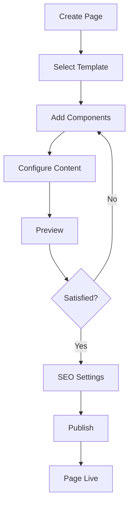

# Product Requirements Document (PRD) - Cms Module

**Module**: Cms
**Version**: 1.0
**Status**: Draft
**Author**: Product Team

---

## Document Control

| Version | Date | Author | Changes |
|---------|------|--------|---------|
| 1.0 | 2026-03-12 | Product Team | Initial draft |

---

## 1. Executive Summary

### 1.1 Problem Statement
> Modern websites require flexible content management with visual page building, component-based architecture, and seamless integration with other content modules. Without a dedicated CMS module, creating and managing static pages, landing pages, and custom layouts requires developer intervention, slowing down content teams and limiting marketing agility. The platform needs a user-friendly CMS that empowers non-technical users to build and manage pages visually.

### 1.2 Proposed Solution
> The Cms module provides a comprehensive content management system with visual page building using Laravel Folio and Livewire Volt, component-based architecture, template system, and integration with Media and Seo modules. It enables marketers and content creators to build custom pages visually, manage site navigation, create landing pages, and maintain consistent branding across the platform without developer assistance.

### 1.3 Business Value Proposition
- **Primary Value**: Empower non-technical users to create and manage web pages independently
- **Secondary Value**: Faster time-to-market for campaigns, consistent branding
- **Strategic Alignment**: Marketing agility, reduced developer dependency, improved content velocity

### 1.4 Success Metrics (High-Level)
| Metric | Current | Target | Timeline |
|--------|---------|--------|----------|
| Page Creation Time | N/A | <30 minutes | Q3 2026 |
| Non-Technical Usage | N/A | 80% of pages | Q3 2026 |
| Template Adoption | N/A | 90% compliance | Q3 2026 |
| SEO Performance | N/A | 85+ average score | Q3 2026 |

---

## 2. Goals & Objectives

### 2.1 Primary Goals (SMART)
1. **Specific**: Build visual page builder with drag-and-drop components using Folio/Volt
2. **Measurable**: Enable 80% of pages to be created by non-technical users in <30 minutes
3. **Achievable**: Leverage Laravel Folio, Livewire Volt, and Filament components
4. **Relevant**: Critical for marketing agility and content operations
5. **Time-bound**: Core page builder by Q2 2026, advanced features by Q3 2026

### 2.2 Secondary Goals
- Implement A/B testing for pages
- Build page analytics and heatmaps
- Create version control and rollback
- Develop multi-variant testing

### 2.3 Non-Goals
> What this module will NOT do (scope boundaries)
- Blog article management (handled by Blog module)
- E-commerce product pages (handled by commerce modules)
- Complex web applications (requires custom development)

### 2.4 Key Results (OKRs)
| Objective | Key Result | Target | Status |
|-----------|------------|--------|--------|
| Page Building Excellence | Pages created/month | 20+ | Pending |
| User Empowerment | Non-dev created pages | 80% | Pending |
| Performance | Page load speed | <2s | Pending |
| SEO Quality | Average SEO score | 85+ | Pending |

---

## 3. Target Users

### 3.1 User Personas

#### Persona 1: Marketing Manager
| Attribute | Details |
|-----------|---------|
| Role | Marketing Lead |
| Goals | Create landing pages quickly for campaigns |
| Pain Points | Developer dependency, slow turnaround |
| Technical Level | Basic |
| Usage Frequency | Weekly |

**User Story**:
> As a Marketing Manager, I want to create landing pages visually without coding, so that I can launch campaigns quickly without waiting for developers.

#### Persona 2: Content Editor
| Attribute | Details |
|-----------|---------|
| Role | Content Team Member |
| Goals | Update website content, manage static pages |
| Pain Points | Complex CMS interfaces, technical barriers |
| Technical Level | Basic |
| Usage Frequency | Daily |

**User Story**:
> As a Content Editor, I want an intuitive page editor with preview, so that I can update content confidently and see changes in real-time.

#### Persona 3: Web Administrator
| Attribute | Details |
|-----------|---------|
| Role | Site Administrator |
| Goals | Manage site structure, navigation, templates |
| Pain Points | Inconsistent pages, broken links, SEO issues |
| Technical Level | Intermediate |
| Usage Frequency | Daily |

**User Story**:
> As a Web Administrator, I want to manage templates and navigation centrally, so that I can maintain site consistency and quality.

### 3.2 Use Cases
| ID | Use Case | Actor | Trigger | Outcome |
|----|----------|-------|---------|---------|
| UC-001 | Create landing page | Marketing Manager | New campaign | Page created |
| UC-002 | Edit static page | Content Editor | Content update | Page updated |
| UC-003 | Manage navigation | Web Admin | Site structure change | Navigation updated |
| UC-004 | Create template | Web Admin | New layout needed | Template available |
| UC-005 | Preview page | Any User | Before publishing | Preview shown |
| UC-006 | Publish page | Authorized User | Page ready | Page goes live |

### 3.3 Pain Points Addressed
| Pain Point | Severity | How Solved |
|------------|----------|------------|
| Developer dependency | High | Visual page builder |
| Slow content updates | High | Real-time editing |
| Inconsistent design | Medium | Template system |
| Poor SEO implementation | Medium | Built-in SEO tools |
| No preview capability | Low | Live preview |

---

## 4. Functional Requirements

### 4.1 Requirements Matrix

| ID | Requirement | Description | Priority | Acceptance Criteria |
|----|-------------|-------------|----------|---------------------|
| FR-001 | Visual Page Builder | Drag-and-drop page building | P0 | Folio/Volt integration |
| FR-002 | Component Library | Reusable page components | P0 | 20+ components |
| FR-003 | Template System | Page templates and layouts | P0 | Template management |
| FR-004 | Navigation Manager | Menu and navigation management | P1 | Hierarchical menus |
| FR-005 | Media Integration | Embed images, videos | P0 | Media module integration |
| FR-006 | SEO Tools | Meta tags, structured data | P1 | Seo module integration |
| FR-007 | Version Control | Page revisions and rollback | P2 | Revision history |
| FR-008 | Multi-language | Content localization | P1 | Lang module integration |
| FR-009 | Publishing Workflow | Draft, preview, publish | P1 | Workflow enforcement |
| FR-010 | Page Analytics | View tracking, heatmaps | P2 | Analytics integration |
| FR-011 | A/B Testing | Page variant testing | P3 | Testing framework |
| FR-012 | Form Builder | Custom form creation | P2 | Form components |

### 4.2 Priority Definitions
- **P0 (Critical)**: Must have for launch - page builder, components, templates
- **P1 (High)**: Should have - navigation, SEO, publishing
- **P2 (Medium)**: Nice to have - versioning, analytics, forms
- **P3 (Low)**: Future consideration - A/B testing

### 4.3 Feature Details

#### Feature 1: Visual Page Builder
**Description**: Drag-and-drop page builder using Laravel Folio and Livewire Volt for visual page construction with real-time preview.

**User Flow**:
```
1. User selects "Create Page"
2. Chooses template or blank canvas
3. Drags components from library
4. Drops components onto page canvas
5. Configures component properties
6. Preview in real-time
7. Publish or save as draft
```

**Acceptance Criteria**:
- [ ] Drag-and-drop interface
- [ ] Real-time preview
- [ ] Component library panel
- [ ] Property editor for components
- [ ] Mobile/desktop preview toggle
- [ ] Undo/redo functionality

**Dependencies**: Laravel Folio, Livewire Volt, Filament

#### Feature 2: Component Library
**Description**: Reusable component library with text blocks, images, videos, forms, CTAs, grids, and custom components.

**Acceptance Criteria**:
- [ ] 20+ pre-built components
- [ ] Custom component creation
- [ ] Component categories
- [ ] Component search
- [ ] Component preview
- [ ] Component configuration options

**Dependencies**: Media Module

#### Feature 3: Template System
**Description**: Template management for consistent page layouts with header, footer, and content area definitions.

**Acceptance Criteria**:
- [ ] Create, edit, delete templates
- [ ] Template preview
- [ ] Template assignment to pages
- [ ] Global template updates
- [ ] Template versioning

**Dependencies**: Filament Admin

---

## 5. Non-Functional Requirements

### 5.1 Performance Requirements
| Metric | Requirement | Measurement |
|--------|-------------|-------------|
| Page Load Time | <2s | Public pages |
| Builder Response | <500ms | Admin operations |
| Preview Generation | <1s | Preview rendering |
| Concurrent Builders | 50+ | Simultaneous users |
| Availability | 99.9% | Monthly uptime |

### 5.2 Security Requirements
- [x] Authentication for admin functions
- [x] Authorization for publishing
- [x] XSS protection (content sanitization)
- [x] CSRF protection
- [x] Template validation
- [x] Audit logging

### 5.3 Scalability Requirements
- Support for 1000+ pages
- Efficient caching strategy
- CDN integration for assets
- Component lazy loading

### 5.4 Compliance Requirements
- [x] GDPR (content removal)
- [x] Accessibility (WCAG 2.1 AA)
- [x] SEO best practices

---

## 6. User Experience

### 6.1 User Flows


### 6.2 Wireframes
> [Links to Figma/Sketch wireframes - to be created]

### 6.3 Design Principles
- Intuitive drag-and-drop interface
- Real-time visual feedback
- Mobile-first responsive design
- Accessible page building

### 6.4 Interaction Specifications
| Interaction | Behavior | Feedback |
|-------------|----------|----------|
| Drag Component | Move from library | Ghost image follows cursor |
| Drop Component | Place on canvas | Snap to grid, highlight |
| Configure | Edit properties | Live preview update |
| Preview | View page | Modal/new tab preview |

---

## 7. Technical Considerations

### 7.1 Architecture Overview
```
┌─────────────────────────────────────────────────────────┐
│                    Cms Module                           │
│  ┌──────────────┐  ┌──────────────┐  ┌──────────────┐  │
│  │ Page         │  │ Component    │  │ Template     │  │
│  │ Builder      │  │ Library      │  │ System       │  │
│  └──────────────┘  └──────────────┘  └──────────────┘  │
│  ┌──────────────┐  ┌──────────────┐  ┌──────────────┐  │
│  │ Navigation   │  │ Publishing   │  │ SEO          │  │
│  │ Manager      │  │ Workflow     │  │ Integration  │  │
│  └──────────────┘  └──────────────┘  └──────────────┘  │
└─────────────────────────────────────────────────────────┘
              │              │              │
              ▼              ▼              ▼
    ┌─────────────┐ ┌─────────────┐ ┌─────────────┐
    │   Media     │ │    Seo      │ │   Lang      │
    │   Module    │ │   Module    │ │   Module    │
    └─────────────┘ └─────────────┘ └─────────────┘
```

### 7.2 Dependencies
| Dependency | Type | Version | Criticality |
|------------|------|---------|-------------|
| Laravel | Framework | 12.x | Critical |
| Laravel Folio | Package | 1.x | Critical |
| Livewire Volt | Package | 1.x | Critical |
| Filament | UI Framework | 5.x | Critical |

### 7.3 Integration Points
| System | Integration Type | Data Flow | Frequency |
|--------|------------------|-----------|-----------|
| Media Module | Asset Management | Inbound | Per page |
| Seo Module | SEO Optimization | Outbound | Per page |
| Lang Module | Localization | Inbound | Per page |
| Blog Module | Content Integration | Optional | As needed |

### 7.4 Technical Constraints
- PHP 8.3+ required
- Laravel 12+ required
- Laravel Folio compatibility
- Livewire Volt compatibility
- Filament v5 compatibility

### 7.5 Database Schema
```sql
CREATE TABLE cms_pages (
    id BIGINT UNSIGNED AUTO_INCREMENT PRIMARY KEY,
    title VARCHAR(255),
    slug VARCHAR(255) UNIQUE,
    template_id BIGINT UNSIGNED,
    content JSON,
    meta_title VARCHAR(255),
    meta_description TEXT,
    status ENUM('draft', 'published', 'archived'),
    published_at TIMESTAMP NULL,
    created_at TIMESTAMP DEFAULT CURRENT_TIMESTAMP,
    updated_at TIMESTAMP DEFAULT CURRENT_TIMESTAMP ON UPDATE CURRENT_TIMESTAMP,
    
    INDEX idx_slug (slug),
    INDEX idx_status (status)
);

CREATE TABLE cms_templates (
    id BIGINT UNSIGNED AUTO_INCREMENT PRIMARY KEY,
    name VARCHAR(100) UNIQUE,
    layout TEXT,
    is_default BOOLEAN DEFAULT FALSE,
    created_at TIMESTAMP DEFAULT CURRENT_TIMESTAMP,
    updated_at TIMESTAMP DEFAULT CURRENT_TIMESTAMP ON UPDATE CURRENT_TIMESTAMP
);

CREATE TABLE cms_navigation (
    id BIGINT UNSIGNED AUTO_INCREMENT PRIMARY KEY,
    name VARCHAR(100),
    parent_id BIGINT UNSIGNED NULL,
    url VARCHAR(255),
    page_id BIGINT UNSIGNED NULL,
    order INT DEFAULT 0,
    is_active BOOLEAN DEFAULT TRUE,
    created_at TIMESTAMP DEFAULT CURRENT_TIMESTAMP,
    updated_at TIMESTAMP DEFAULT CURRENT_TIMESTAMP ON UPDATE CURRENT_TIMESTAMP,
    
    FOREIGN KEY (parent_id) REFERENCES cms_navigation(id)
);
```

---

## 8. Analytics & Metrics

### 8.1 Success Metrics (KPIs)
| KPI | Definition | Target | Measurement Method |
|-----|------------|--------|-------------------|
| Pages Created | Count per month | 20+ | Database count |
| Non-Dev Usage | % by non-developers | 80% | User tracking |
| Page Load Speed | Average load time | <2s | Analytics |
| SEO Score | Average SEO rating | 85+ | Seo module |

### 8.2 Tracking Requirements
- Page views, unique visitors
- Builder usage metrics
- Component usage statistics
- Template adoption rates

### 8.3 Reporting Dashboards
- Page performance overview
- Builder usage statistics
- Template effectiveness
- SEO performance

---

## 9. Go-to-Market

### 9.1 Launch Criteria
- [x] All P0 features complete
- [ ] Page builder tested with users
- [ ] Template library populated
- [ ] Documentation complete
- [ ] Training materials ready

### 9.2 Marketing Requirements
- [ ] Internal demo
- [ ] User training sessions
- [ ] Template showcase
- [ ] Best practices guide

### 9.3 Sales Enablement
- N/A (Internal tool)

### 9.4 Customer Support Needs
- [ ] User guide
- [ ] Video tutorials
- [ ] FAQ
- [ ] Template documentation

---

## 10. Timeline & Milestones

### 10.1 Key Dates
| Milestone | Date | Status |
|-----------|------|--------|
| Requirements Complete | 2026-03-12 | Complete |
| Design Complete | 2026-03-26 | Pending |
| Development Start | 2026-03-27 | Pending |
| Core Features (P0) | 2026-04-17 | Pending |
| Beta Launch | 2026-04-24 | Pending |
| GA Launch | 2026-05-08 | Pending |

### 10.2 Phase Breakdown
**Phase 1: Discovery** (Weeks 1-2)
- Page builder research
- Competitive analysis
- User interviews

**Phase 2: Design** (Weeks 3-4)
- Builder UX design
- Component design
- Template design

**Phase 3: Development** (Weeks 5-10)
- Sprint 1-2: Page builder, components
- Sprint 3-4: Templates, navigation
- Sprint 5: SEO, polish

**Phase 4: Testing** (Weeks 11-12)
- QA testing
- User acceptance testing
- Performance testing

**Phase 5: Launch** (Week 13)
- Beta with marketing team
- GA launch

### 10.3 Dependencies
| Dependency | On Whom | Due Date | Status |
|------------|---------|----------|--------|
| Laravel Folio | Framework | 2026-03-20 | Pending |
| Livewire Volt | Framework | 2026-03-20 | Pending |
| Media Module | Media Team | 2026-04-01 | Pending |

### 10.4 Risk Mitigation
| Risk | Probability | Impact | Mitigation |
|------|-------------|--------|------------|
| Complex builder UX | Medium | High | User testing, iteration |
| Performance issues | Low | High | Caching, optimization |
| Low adoption | Medium | Medium | Training, support |

---

## 11. Open Questions

| ID | Question | Owner | Due Date | Status |
|----|----------|-------|----------|--------|
| Q-001 | Should we support custom HTML components? | Tech Lead | 2026-03-20 | Open |
| Q-002 | What is the template approval workflow? | Product | 2026-03-20 | Open |
| Q-003 | Should we implement multi-variant testing? | Product | 2026-04-01 | Open |

---

## 12. Appendix

### 12.1 Glossary
| Term | Definition |
|------|------------|
| Page Builder | Visual tool for creating pages |
| Component | Reusable page element |
| Template | Pre-designed page layout |
| Navigation | Site menu structure |
| Folio | Laravel page routing package |
| Volt | Livewire functional API |

### 12.2 References
- [Laravel Folio Documentation](https://github.com/laravel/folio)
- [Livewire Volt Documentation](https://github.com/livewire/volt)
- [Filament Documentation](https://filamentphp.com/docs)

### 12.3 Related PRDs
- [Blog Module PRD](../Blog/docs/PRD.md)
- [Media Module PRD](../Media/docs/PRD.md)
- [Seo Module PRD](../Seo/docs/PRD.md)
- [Lang Module PRD](../Lang/docs/PRD.md)

---

## Approval

| Role | Name | Signature | Date |
|------|------|-----------|------|
| Product Manager | | | |
| Engineering Lead | | | |
| Design Lead | | | |
| Stakeholder | | | |
