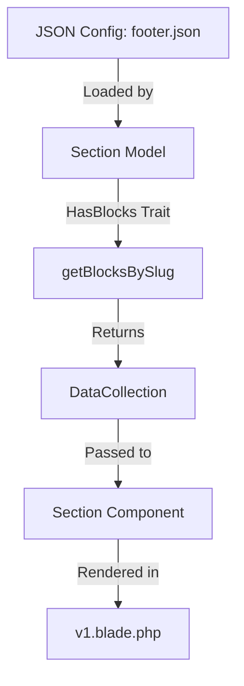

# Block Data Flow Architecture

This document describes how data flows from the JSON configuration to the final Blade components in the CMS module.

## Component Hierarchy

1. **`Modules\Cms\View\Components\Section`**: The main entry point. It receives a `slug` (e.g., 'footer').
2. **`Modules\Cms\Models\Section`**: The model representing a page section. It uses the `HasBlocks` trait.
3. **`Modules\Cms\Models\Traits\HasBlocks`**: Provides the `getBlocksBySlug($slug)` method.
4. **`Modules\Cms\Datas\BlockData`**: A DTO (Data Transfer Object) that wraps block information.

## Data Flow



### BlockData Structure
Each `BlockData` object contains:
- `type`: The type of block (e.g., 'footer').
- `slug`: The specific block identifier (e.g., 'main-footer').
- `data`: An **associative array** containing the actual content (brand, social, links, etc.).
- `view`: The blade view path to render.

### Accessing Data in Blade
In the component blade (e.g., `v1.blade.php`), you must iterate over the `$blocks` collection:

```php
@foreach ($blocks as $block)
    @if ($block->type === 'footer')
        @php $data = $block->data; @endphp
        {{-- Access $data['brand'], $data['social'], etc. --}}
    @endif
@endforeach
```

## Correct Usage Patterns

> [!IMPORTANT]
> **NEVER** call theme sections directly using the theme namespace (e.g., `<x-two::... />`).
> Always use the **Section Component** provided by the CMS module.

### The `x-section` Component
The correct way to render any data-driven section is:
```blade
<x-section slug="footer" />
```
This automatically:
1. Loads the `Section` model by slug.
2. Fetches the associated blocks using the `HasBlocks` trait.
3. Resolves the view using the `pub_theme` namespace (which points to the active theme's `resources/views/components/sections/{slug}/{tpl}.blade.php`).
4. Passes the `$blocks` collection and context to the view.

### Theme Namespace (`pub_theme`)
The CMS module registers a `pub_theme` view namespace that dynamically points to the currently active theme. This allows the same `x-section` component to work across different themes.

> [!TIP]
> Always use `isset()` or null coalescing operator when accessing `$block->data` keys, as the JSON structure might vary between themes.
