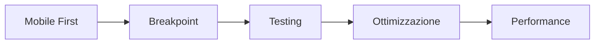

# Responsive Design: Armonia tra Dispositivi

## Aspetti Tecnici

### 1. Breakpoint e Fluidità
- **Sistema Grid Fluido**
  ```html
  <div class="
    container 
    mx-auto 
    px-4
    sm:px-6 
    lg:px-8
  ">
    <div class="
      grid 
      grid-cols-1 
      sm:grid-cols-2 
      lg:grid-cols-3 
      gap-4
    ">
      <!-- Contenuto -->
    </div>
  </div>
  ```

- **Media Queries Avanzate**
  ```css
  @media (min-width: 640px) and (max-width: 1023px) {
    /* Tablet styles */
  }
  
  @media (min-width: 1024px) and (orientation: landscape) {
    /* Desktop landscape */
  }
  ```

- **Container Queries**
  ```css
  .card {
    container-type: inline-size;
  }

  @container (min-width: 400px) {
    .card {
      /* Stili per card più grandi */
    }
  }
  ```

### 2. Immagini Responsive
```html
<picture>
  <source 
    media="(min-width: 1024px)" 
    srcset="large.jpg"
  >
  <source 
    media="(min-width: 640px)" 
    srcset="medium.jpg"
  >
  
</picture>
```

### 3. Typography Responsive
```css
:root {
  --fluid-min: 1rem;
  --fluid-max: 1.5rem;
  --fluid-screen: 80rem;
}

h1 {
  font-size: clamp(
    var(--fluid-min),
    calc(var(--fluid-min) * 1.5 + (var(--fluid-max) - var(--fluid-min)) * ((100vw - 20rem) / (var(--fluid-screen) - 20rem))),
    var(--fluid-max)
  );
}
```

## Aspetti Filosofici

### 1. Taoismo e Fluidità
- **Principio del Wu Wei**
  - Adattamento naturale
  - Non-forzatura
  - Implementazione:
    ```html
    <div class="
      transition-all 
      duration-300 
      ease-in-out
    ">
      <!-- Contenuto fluido -->
    </div>
    ```

### 2. Ermeneutica del Design
- **Interpretazione contestuale**
  - Significato in relazione al dispositivo
  - Adattamento semantico
  ```html
  <div class="
    text-base 
    sm:text-lg 
    lg:text-xl
  ">
    <!-- Testo adattivo -->
  </div>
  ```

### 3. Filosofia della Complessità
```html
<!-- Sistema Adattivo -->
<div class="
  grid 
  auto-rows-min 
  auto-cols-min
  gap-4
  [&>*]:transition-all
  [&>*]:duration-300
">
  <!-- Elementi auto-organizzanti -->
</div>
```

## Aspetti Pratici

### 1. Strumenti di Testing
- **Browser DevTools**
  - Device toolbar
  - Network throttling
  - Performance analysis

- **Strumenti Online**
  - BrowserStack
  - Responsive Design Checker
  - Google Mobile-Friendly Test

### 2. Workflow di Sviluppo


### 3. Performance Optimization
```javascript
// Intersection Observer per lazy loading
const observer = new IntersectionObserver((entries) => {
  entries.forEach(entry => {
    if (entry.isIntersecting) {
      const img = entry.target;
      img.src = img.dataset.src;
      observer.unobserve(img);
    }
  });
});

// Adaptive Loading
const loadAdaptiveContent = () => {
  const connection = navigator.connection;
  if (connection && connection.effectiveType) {
    switch(connection.effectiveType) {
      case '4g':
        // Carica contenuti HD
        break;
      case '3g':
        // Carica contenuti standard
        break;
      case '2g':
        // Carica contenuti essenziali
        break;
    }
  }
};
```

## Aspetti Politici e Sociali

### 1. Digital Divide
- **Accessibilità Globale**
  ```html
  <div class="
    min-h-screen 
    flex 
    flex-col
  ">
    <main class="
      flex-grow 
      container 
      mx-auto 
      px-4
    ">
      <!-- Contenuto accessibile -->
    </main>
  </div>
  ```

### 2. Sostenibilità Digitale
- **Ottimizzazione Risorse**
  - Lazy loading
  - Compressione immagini
  - Caching strategico

### 3. Inclusività Digitale
```html
<!-- Design Inclusivo -->
<div class="
  supports-[display:grid]:grid 
  supports-[not(display:grid)]:flex 
  flex-col
">
  <!-- Layout adattivo -->
</div>
```

## Aspetti Spirituali

### 1. Meditazione e Responsività
- **Flusso di Energia**
  - Layout organico
  - Spaziatura armoniosa
  ```html
  <div class="
    space-y-4 
    sm:space-y-6 
    lg:space-y-8
  ">
    <!-- Elementi in armonia -->
  </div>
  ```

### 2. Simbolismo Spaziale
- **Geometria Sacra**
  - Proporzioni auree
  - Ritmo visivo
  ```css
  .golden-ratio {
    aspect-ratio: 1.618;
  }
  ```

### 3. Armonia Universale
```html
<!-- Layout Universale -->
<div class="
  grid 
  [grid-template-areas:'header''main''footer']
  md:[grid-template-areas:'header header''main sidebar''footer footer']
">
  <!-- Elementi in armonia -->
</div>
```

## Best Practices

### 1. Performance Mobile
```javascript
// Intersection Observer per lazy loading
const observer = new IntersectionObserver((entries) => {
  entries.forEach(entry => {
    if (entry.isIntersecting) {
      const img = entry.target;
      img.src = img.dataset.src;
      observer.unobserve(img);
    }
  });
});
```

### 2. Accessibilità Mobile
```html
<button 
  class="
    touch-target 
    min-w-[44px] 
    min-h-[44px]
  "
  aria-label="Azione mobile"
>
  <!-- Contenuto -->
</button>
```

### 3. SEO Mobile
```html
<!-- Mobile SEO -->
<meta name="viewport" content="width=device-width, initial-scale=1.0">
<meta name="theme-color" content="#ffffff">
<link rel="manifest" href="/manifest.json">
```

## Collegamenti
- [Torna alla documentazione principale](../webdesign.md)
- [Vai a UX/UI Design](./ux-ui-design.md)
- [Vai a Tipografia](./tipografia.md) 
