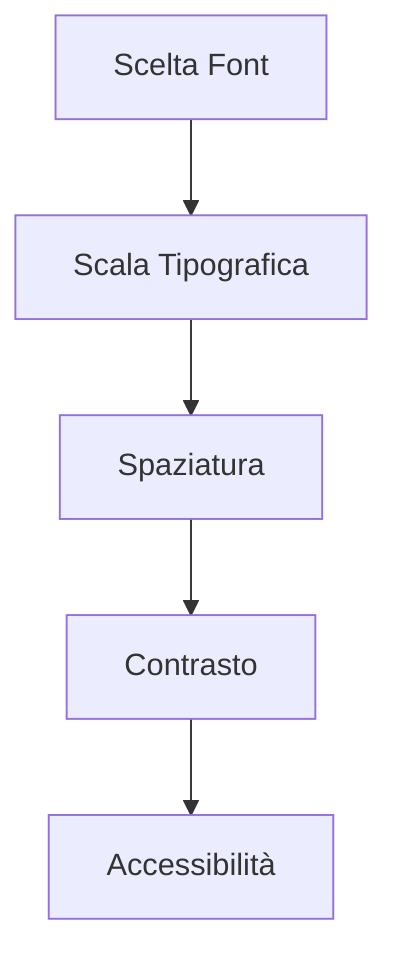

# Tipografia: L'Arte della Comunicazione Visiva

## Aspetti Tecnici

### 1. Sistema Tipografico
- **Scala Modulare**
  ```css
  :root {
    --type-scale: 1.25;
    --text-base: 1rem;
    
    --text-xs: calc(var(--text-base) / var(--type-scale));
    --text-sm: var(--text-base);
    --text-md: calc(var(--text-base) * var(--type-scale));
    --text-lg: calc(var(--text-md) * var(--type-scale));
    --text-xl: calc(var(--text-lg) * var(--type-scale));
  }
  ```

- **Implementazione Tailwind**
  ```html
  <div class="
    text-base 
    leading-relaxed 
    tracking-wide
  ">
    <h1 class="text-4xl font-bold">Titolo</h1>
    <p class="text-lg">Paragrafo</p>
    <small class="text-sm">Note</small>
  </div>
  ```

### 2. Web Fonts
```html
<!-- Ottimizzazione caricamento font -->
<link 
  rel="preload" 
  href="font.woff2" 
  as="font" 
  type="font/woff2" 
  crossorigin
>

<style>
  @font-face {
    font-family: 'Custom Font';
    src: url('font.woff2') format('woff2');
    font-display: swap;
  }
</style>
```

## Aspetti Filosofici

### 1. Zen e Tipografia
- **Principio del Ma (間)**
  - Spazio tra le lettere
  - Ritmo visivo
  ```html
  <p class="
    tracking-wide 
    leading-loose 
    space-y-4
  ">
    <!-- Testo con spaziatura zen -->
  </p>
  ```

### 2. Semiotica Tipografica
- **Significato dei Caratteri**
  - Serif: tradizione, autorità
  - Sans-serif: modernità, pulizia
  - Script: personalità, creatività
  ```html
  <div class="
    font-serif 
    text-gray-900 
    dark:text-gray-100
  ">
    <!-- Testo tradizionale -->
  </div>
  ```

## Aspetti Pratici

### 1. Strumenti
- **Font Pairing**
  - Google Fonts
  - Adobe Fonts
  - Font Squirrel

- **Generatori di Scala**
  - Type Scale
  - Modular Scale
  - Golden Ratio Typography Calculator

### 2. Workflow


## Aspetti Politici e Sociali

### 1. Inclusività Tipografica
- **Leggibilità Universale**
  ```html
  <p class="
    text-base 
    leading-relaxed 
    max-w-prose
    font-sans 
    antialiased
  ">
    <!-- Testo accessibile -->
  </p>
  ```

### 2. Cultural Sensitivity
- **Supporto Multilingua**
  ```html
  <div class="
    font-sans 
    [&:lang(ar)]:font-arabic
    [&:lang(ja)]:font-japanese
  ">
    <!-- Testo multilingue -->
  </div>
  ```

## Aspetti Spirituali

### 1. Meditazione Tipografica
- **Ritmo Visivo**
  - Cadenza del testo
  - Pausa visiva
  ```html
  <div class="
    space-y-8 
    max-w-3xl 
    mx-auto
  ">
    <!-- Testo con ritmo -->
  </div>
  ```

### 2. Simbolismo Tipografico
- **Geometria Sacra**
  - Proporzioni auree
  - Ritmo visivo
  ```css
  .golden-text {
    line-height: 1.618;
    letter-spacing: 0.618em;
  }
  ```

## Best Practices

### 1. Performance
```javascript
// Ottimizzazione caricamento font
document.fonts.ready.then(() => {
  document.documentElement.classList.add('fonts-loaded');
});
```

### 2. Accessibilità
```html
<p 
  class="
    text-base 
    leading-relaxed
  "
  aria-label="Contenuto principale"
>
  <!-- Testo accessibile -->
</p>
```

## Collegamenti
- [Torna alla documentazione principale](../webdesign.md)
- [Vai a UX/UI Design](./ux-ui-design.md)
- [Vai a Responsive Design](./responsive-design.md) 
