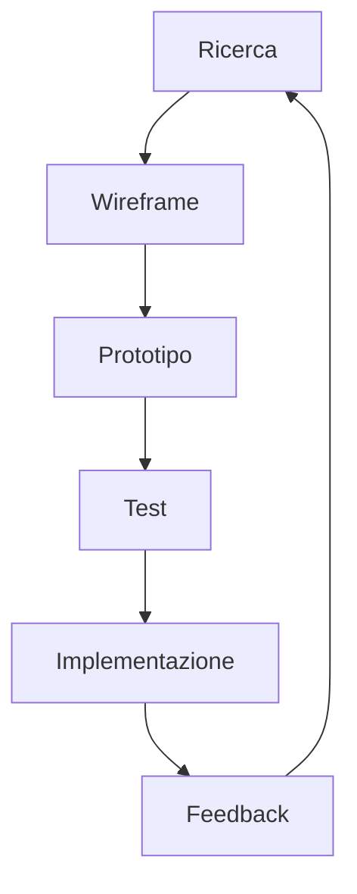

# UX/UI Design: Un Approccio Olistico

## Aspetti Tecnici

### 1. Leggi Fondamentali
- **Legge di Fitts**
  - Formula matematica: MT = a + b log2(D/W + 1)
  - Implementazione pratica:
    ```html
    <!-- Esempio Tailwind -->
    <button class="min-w-[44px] min-h-[44px] p-2 m-1">
      <!-- Contenuto -->
    </button>
    ```
  - **Ottimizzazione per Touch**
    ```html
    <!-- Touch target ottimizzato -->
    <button class="
      min-w-[48px] 
      min-h-[48px] 
      p-3 
      m-2
      active:scale-95 
      transition-transform
    ">
      <!-- Contenuto -->
    </button>
    ```

- **Legge di Hick**
  - Tempo di decisione: T = b log2(n + 1)
  - Implementazione menu:
    ```html
    <nav class="flex space-x-4">
      <!-- Max 7 elementi -->
    </nav>
    ```
  - **Ottimizzazione Scelte**
    ```html
    <!-- Menu gerarchico -->
    <nav class="space-y-2">
      <div class="font-bold">Categorie Principali</div>
      <ul class="space-y-1">
        <!-- Max 5 sottocategorie -->
      </ul>
    </nav>
    ```

### 2. Pattern di Design
- **Componenti Riutilizzabili**
  ```html
  <!-- Card Component -->
  <div class="
    bg-white 
    dark:bg-gray-800 
    rounded-lg 
    shadow-md 
    p-4 
    transition-all 
    duration-300
    hover:shadow-lg
  ">
    <!-- Contenuto -->
  </div>
  ```

- **Sistema di Grid**
  ```html
  <div class="
    grid 
    grid-cols-1 
    md:grid-cols-2 
    lg:grid-cols-3 
    gap-4
  ">
    <!-- Cards -->
  </div>
  ```

### 3. Psicologia Cognitiva
- **Gestalt Principles**
  ```html
  <!-- Prossimità -->
  <div class="space-y-4">
    <!-- Elementi correlati -->
  </div>

  <!-- Similarità -->
  <div class="flex space-x-4">
    <button class="btn-primary">Azione 1</button>
    <button class="btn-primary">Azione 2</button>
  </div>

  <!-- Chiusura -->
  <div class="rounded-lg border-2 border-dashed">
    <!-- Contenuto suggerito -->
  </div>
  ```

## Aspetti Filosofici

### 1. Zen e Design
- **Principio del Ma**
  - Spazio vuoto come elemento di design
  - Equilibrio tra pieno e vuoto
  - Implementazione:
    ```html
    <div class="
      p-8 
      space-y-8
      max-w-3xl 
      mx-auto
    ">
      <!-- Contenuto con spaziatura zen -->
    </div>
    ```

### 2. Filosofia Occidentale
- **Aristotele e la Retorica**
  - Ethos, Pathos, Logos nel design
  - Gerarchia visiva come persuasione
  ```html
  <div class="
    text-center 
    space-y-4
  ">
    <h1 class="text-4xl font-bold">Ethos</h1>
    <p class="text-xl">Pathos</p>
    <div class="text-base">Logos</div>
  </div>
  ```

### 3. Filosofia Orientale
- **Yin e Yang nel Design**
  ```html
  <div class="
    flex 
    items-center 
    justify-center
  ">
    <div class="
      w-32 
      h-32 
      rounded-full 
      bg-black 
      dark:bg-white
    "></div>
    <div class="
      w-32 
      h-32 
      rounded-full 
      bg-white 
      dark:bg-black
    "></div>
  </div>
  ```

## Aspetti Pratici

### 1. Strumenti
- **Design System**
  - Tailwind CSS
  - Storybook
  - Figma
  - Adobe XD

### 2. Workflow


### 3. Testing e Validazione
```javascript
// A/B Testing
const experiment = {
  variantA: {
    buttonColor: 'blue',
    fontSize: '16px'
  },
  variantB: {
    buttonColor: 'green',
    fontSize: '18px'
  }
};

// Heatmap Tracking
const trackInteraction = (element, event) => {
  // Logica di tracciamento
};
```

## Aspetti Politici e Sociali

### 1. Design Inclusivo
- **Accessibilità**
  ```html
  <button 
    class="
      px-4 py-2 
      bg-blue-600 
      text-white
    "
    aria-label="Azione principale"
  >
    <!-- Contenuto -->
  </button>
  ```

### 2. Etica del Design
- **Dark Patterns**
  - Evitare manipolazione
  - Trasparenza
  - Consenso informato

### 3. Sostenibilità Digitale
```html
<!-- Design Sostenibile -->
<div class="
  bg-gray-50 
  dark:bg-gray-900
  text-gray-900 
  dark:text-gray-100
">
  <!-- Contenuto a basso consumo energetico -->
</div>
```

## Aspetti Spirituali

### 1. Meditazione e Design
- **Flusso di Coscienza**
  - User flow naturale
  - Eliminazione di attriti
  - Esperienza fluida

### 2. Simbolismo
- **Colori e Significati**
  ```html
  <div class="
    bg-red-100 
    text-red-900
    dark:bg-red-900 
    dark:text-red-100
  ">
    <!-- Avviso importante -->
  </div>
  ```

### 3. Geometria Sacra
```html
<!-- Proporzione Aurea -->
<div class="
  w-full 
  aspect-[1.618]
  grid 
  grid-cols-[1fr_0.618fr]
">
  <!-- Layout aureo -->
</div>
```

## Best Practices

### 1. Performance
```javascript
// Ottimizzazione animazioni
const observer = new IntersectionObserver((entries) => {
  entries.forEach(entry => {
    if (entry.isIntersecting) {
      entry.target.classList.add('animate-fade-in');
    }
  });
});
```

### 2. Accessibilità
```html
<div 
  role="alert" 
  aria-live="polite"
  class="
    sr-only 
    focus:not-sr-only
  "
>
  <!-- Messaggio importante -->
</div>
```

### 3. SEO e UX
```html
<!-- Schema Markup -->
<script type="application/ld+json">
{
  "@context": "https://schema.org",
  "@type": "WebPage",
  "name": "Pagina Principale",
  "description": "Descrizione della pagina",
  "url": "https://example.com"
}
</script>
```

## Collegamenti
- [Torna alla documentazione principale](../webdesign.md)
- [Vai a Responsive Design](./responsive-design.md)
- [Vai a Tipografia](./tipografia.md) 
